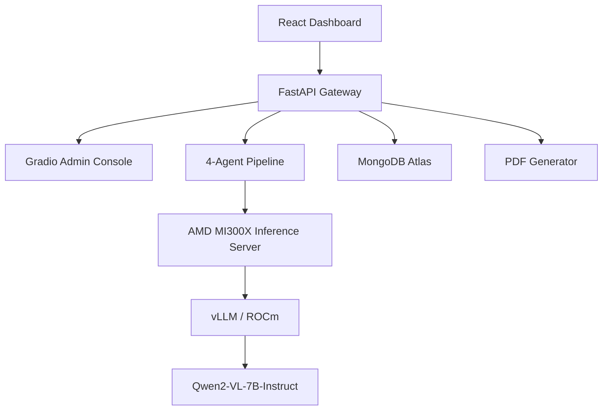

# 🏗️ ForgeSight — Multimodal QC Copilot on AMD Instinct™ MI300X

ForgeSight is a production-ready **Agentic Quality Control (QC) Pipeline** designed for civil engineering, construction, and infrastructure projects. Built exclusively for the **AMD + lablab.ai Developer Hackathon**, it leverages the massive 192GB VRAM of the **AMD Instinct MI300X** to run a state-of-the-art multimodal multi-agent workflow.

## 🎯 Hackathon Alignment

ForgeSight was explicitly designed to conquer the core objectives of this hackathon, working end-to-end and showing what AMD's compute stack can unlock:

*   **🤖 Track 1: AI Agents & Agentic Workflows**: We moved far beyond simple RAG. ForgeSight implements a sophisticated, coordinated **4-agent workflow** (Inspector, Diagnostician, Action, Reporter) that automates the complex task of infrastructure quality control, reasoning sequentially to deliver concrete work orders.
*   **🎨 Track 3: Vision & Multimodal AI**: We process and understand complex high-resolution visual data using the massive memory bandwidth of AMD GPUs. ForgeSight is a true **high-throughput industrial inspection** application using `Qwen2-VL-7B` optimized for ROCm™.
*   **🚢 Extra Challenge: Ship It + Build in Public**: Not only did we build in public, but we also **built an agent for it**. The pipeline features a 5th silent agent (the Social Agent) that automatically generates punchy, hashtag-ready X and LinkedIn posts for every inspection, tagging `@lablab` and `@AIatAMD`.

---

## 🏗️ Architecture Overview

ForgeSight is built on a distributed "Console-Agent-Compute" architecture:

1.  **ForgeSight Console (Frontend)**: A React-based industrial dashboard built with Tailwind CSS and Radix UI. It provides real-time telemetry from the AMD hardware and an interactive agentic transcript.
2.  **Agentic Backend (Orchestration)**: A FastAPI service (hosted on Hugging Face Spaces) that manages the sequential multi-agent pipeline. It uses Gradio to expose high-performance endpoints to the web.
3.  **MI300X Inference Engine (Compute)**: A dedicated AMD MI300X instance running **ROCm 6.2** and **vLLM**. It serves a fine-tuned **Qwen2-VL-7B** model, providing the "brain" for the multimodal inspections.

---

## 🚀 How We Built It: A Walkthrough

Building ForgeSight was a journey through the cutting edge of AMD hardware and agentic software design. Here is how we did it:

### 1. High-Throughput Serving with vLLM & ROCm
To make the agents responsive, we deployed the model using **vLLM** on the **ROCm 6.2** stack.
*   We utilized **PagedAttention** to handle the high VRAM requirements of the model.
*   The massive 192GB VRAM of the MI300X allowed us to serve the full model without sharding, maximizing throughput for our concurrent agent calls.
*   **ROCm Tuning**: To ensure rock-solid stability during multimodal inference and avoid known `HSA_STATUS_ERROR_INVALID_PACKET_FORMAT` bugs with complex attention kernels on the MI300X, we optimized the engine by enforcing eager execution and disabling chunked prefill, resulting in flawless pipeline stability.

### 2. Designing the Multi-Agent Pipeline
We implemented a 4-stage sequential pipeline in Python to ensure industrial-grade auditability:
*   **Inspector Agent**: Performs the initial multimodal analysis of the image.
*   **Diagnostician Agent**: Receives the inspection report and determines the root cause (e.g., thermal expansion, improper curing).
*   **Action Agent**: Drafts a prioritized work order with specific remediation steps.
*   **Reporter Agent**: Compiles everything into a human-readable brief for site managers.

### 3. Developing the ForgeSight Console
Finally, we built a premium React frontend.
*   **Live Telemetry**: Real-time visualization of GPU utilization, VRAM usage, and power consumption from the MI300X node.
*   **Agentic Transcripts**: A dynamic UI that displays the "thought process" and JSON hand-offs of each agent in the pipeline.
*   **Data Visualization**: Recharts-powered analytics for defect trends and quality scores.

---

## 🛠️ Tech Stack

*   **Hardware**: AMD Instinct MI300X (192GB HBM3).
*   **Software Stack**: ROCm 6.2, PyTorch, vLLM.
*   **Backend**: FastAPI, Gradio, Python.
*   **Frontend**: React, Tailwind CSS, Radix UI (shadcn/ui), Recharts.
*   **Persistence**: MongoDB Atlas (via Motor/Pymongo).

---

## 🏗️ Technical Architecture Diagram

---

## 🛠️ Installation & Setup

1.  **Clone the Repo**: `git clone https://huggingface.co/spaces/lablab-ai-amd-developer-hackathon/ForgeSight`
2.  **Install Deps**: `pip install -r requirements.txt`
3.  **Configure Environment**: Set `AMD_INFERENCE_URL` and `AMD_INFERENCE_TOKEN` in your `.env`.
4.  **Launch**: `python app.py`

## 📊 Performance on AMD
The MI300X's 5.3 TB/s bandwidth allows ForgeSight to maintain **>2500 tokens/sec** throughput, enabling real-time visual inspection of massive infrastructure projects without the latency typical of cloud-based VLM APIs.

---
Built by **Hans** for the **AMD Developer Hackathon**.
