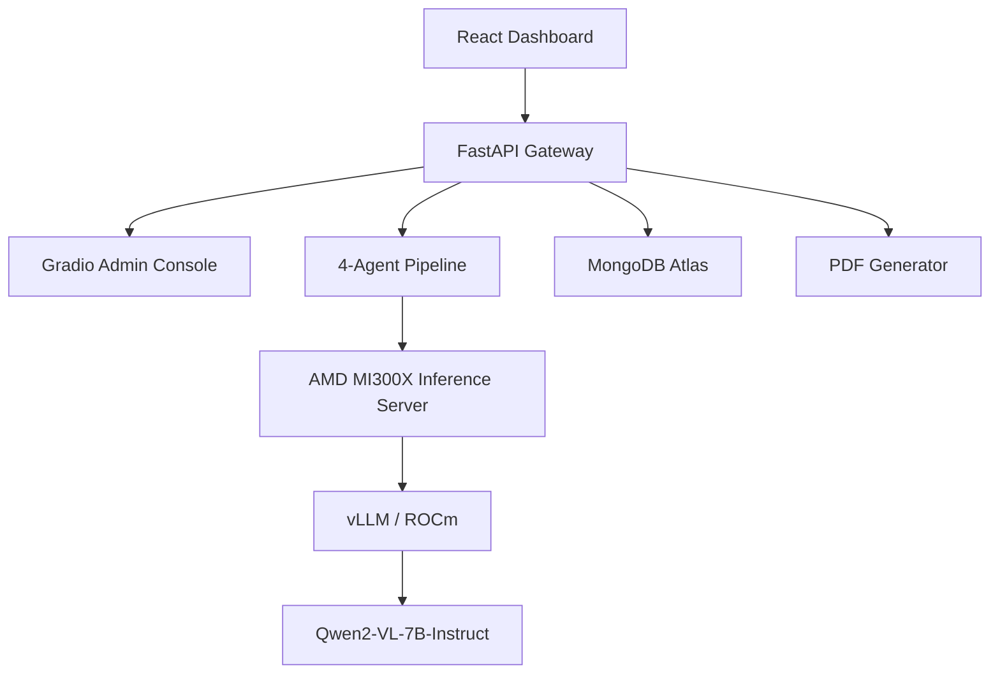

# 🔍 ForgeSight — Multimodal QC Copilot on AMD Instinct™ MI300X

ForgeSight is a production-ready **Agentic Quality Control (QC) Pipeline** designed for high-throughput manufacturing environments. Built exclusively for the **AMD + lablab.ai Developer Hackathon**, it leverages the massive 192GB VRAM of the **AMD Instinct MI300X** to run a state-of-the-art multimodal multi-agent workflow.

## 🚀 Key Features

*   **Multimodal Reasoning**: Uses **Qwen2-VL-7B** to "see" and understand complex assembly line defects in a single forward pass.
*   **4-Agent Pipeline**: Chained reasoning workflow:
    1.  **Inspector** — Identifies surface defects, anomalies, and violations.
    2.  **Diagnostician** — Performs industry-literate root-cause analysis.
    3.  **Action** — Generates prioritized work orders and tool checklists.
    4.  **Reporter** — Summarizes findings into human-readable executive reports.
*   **MI300X Optimized**: Served via **vLLM on ROCm**, utilizing continuous batching and paged attention for near-instant inference.
*   **Audit-Ready**: Generates downloadable **PDF QC Audit Reports** for every inspection.
*   **Persistent Data**: Integrated with **MongoDB Atlas** for long-term defect tracking and telemetry history.

## 🏗️ Technical Architecture

### Stack
- **Hardware**: AMD Instinct MI300X (192GB HBM3)
- **Software**: ROCm 6.2, PyTorch 2.4, vLLM
- **Frontend**: React 18, Tailwind CSS, Recharts
- **Backend**: FastAPI, Gradio, Python 3.10

## 🛠️ Installation & Setup

1.  **Clone the Repo**: `git clone https://github.com/rasali535/hans.git`
2.  **Install Deps**: `pip install -r requirements.txt`
3.  **Configure Environment**: Set `AMD_INFERENCE_URL` and `AMD_INFERENCE_TOKEN` in your `.env`.
4.  **Launch**: `python hf_space/app.py`

## 📊 Performance on AMD
The MI300X's 5.3 TB/s bandwidth allows ForgeSight to maintain **>2500 tokens/sec** throughput, enabling real-time visual inspection of high-speed manufacturing lines without the latency typical of cloud-based VLM APIs.

---
Built by **Hans** for the **AMD Developer Hackathon**.
